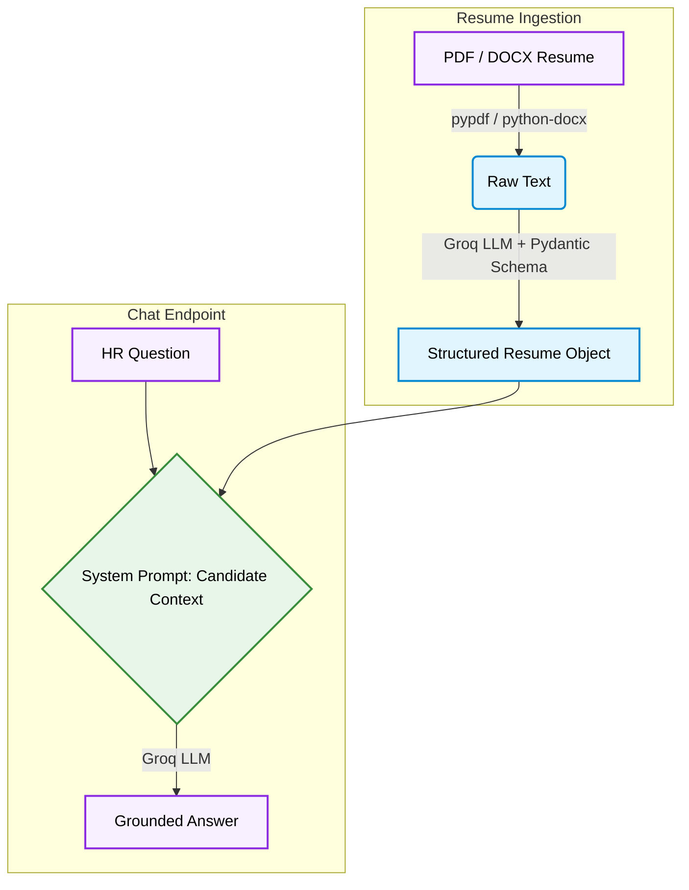

# Hire-Me-AI

A FastAPI backend that parses a PDF resume into structured data and lets HR
chat with an AI that represents the candidate - grounded only in what the
resume actually says.

```
HR: "What frameworks has this candidate worked with?"
AI: "Based on the resume, the candidate has worked with FastAPI, Streamlit,
     and Flask across their internship and project experience."
```

No hallucination. No generic answers. Every response is anchored to the
parsed resume.

---

## Stack

| Layer | Choice |
|---|---|
| API | `FastAPI` + `Uvicorn` |
| LLM | `Groq` - `openai/gpt-oss-120b` |
| Schema Validation | `Pydantic` |
| PDF Parsing | `pypdf` |
| DOCX Parsing | `python-docx` |

---

## How It Works



##  Features

| | |
|---|---|
|  **PDF + DOCX Support** | Extracts raw text from any standard resume format |
|  **Schema-Driven Parsing** | Resume is parsed into a fixed Pydantic schema regardless of section headings or formatting |
|  **Candidate AI** | The LLM answers as the candidate - professional, fact-bound, no invention |
|  **No Hallucination Guard** | If information is missing from the resume, the AI says so rather than guessing |
|  **Groq-Powered** | Fast structured-JSON inference via `openai/gpt-oss-120b` |

---

##  Tech Stack

| Component | Technology |
|---|---|
| API Framework | FastAPI |
| LLM | Groq - `openai/gpt-oss-120b` |
| Schema Validation | Pydantic |
| PDF Parsing | pypdf |
| DOCX Parsing | python-docx |
| Dependency Management | uv |

---

##  Project Structure

```
Hire-Me-AI/
├── backend/
│   ├── main.py          # FastAPI app - resume parsing + /chat endpoint
│   └── my_resume.pdf    # Drop your resume here
├── main.py              # Entry point
├── pyproject.toml
└── README.md
```

---

##  Setup and Installation

### Prerequisites

- Python 3.11+
- A [Groq API key](https://console.groq.com/keys)
- [`uv`](https://docs.astral.sh/uv/) installed

### 1. Clone the repository

```bash
git clone https://github.com/Shashank17singh/Hire-Me-AI.git
cd Hire-Me-AI
```

### 2. Install dependencies

```bash
uv sync
```

### 3. Set your Groq API key

```bash
cp .env.example .env
# then edit .env and add: GROQ_API_KEY=your_api_key_here
```

### 4. Add your resume

Drop your PDF or DOCX resume into `backend/` and update the filename reference in `backend/main.py`:

```python
resume_text = read_pdf(Path("your_resume.pdf"))
```

### 5. Start the server

```bash
cd backend
uv run uvicorn main:app --reload
```

---

##  API Reference

### `GET /`

Health check.

```json
{ "message": "Ye home page hai" }
```

### `POST /chat`

Ask a question about the candidate.

**Request body**
```json
{ "question": "What is this candidate's strongest technical skill?" }
```

**Response**
```json
{
  "answer": "Based on the resume, the candidate's strongest technical skill is..."
}
```

---

##  Known Limitations

- One resume at a time - the server loads and parses the PDF on every `/chat` request. Add caching if you plan to screen in bulk.
- Scanned / image-only PDFs with no extractable text will return empty parses; use a text-based PDF.
